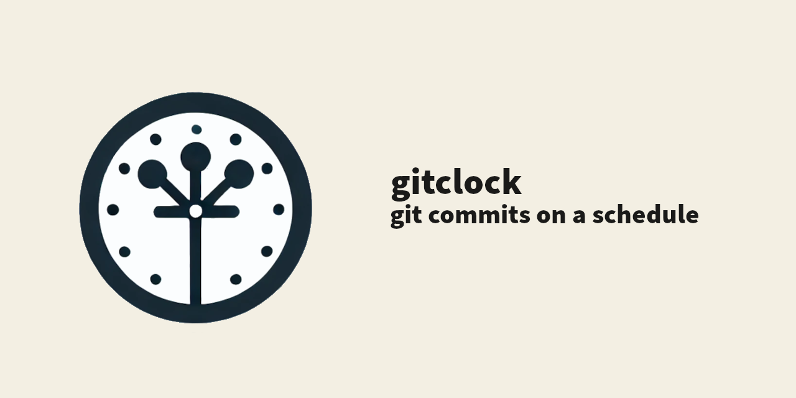

# GitClock

Want all your commits to have dates within specific ranges? Want to avoid leaking your current timezone through your commit log?

That's what GitClock does for you.



## Installation

To install GitClock, you can run the following:
```shell
sudo npm install -g github:conradkleinespel/gitclock
sudo ln -sf $(npm root -g)/@conradkleinespel/gitclock/index.js /usr/local/bin/gitclock
```

You may want to run GitClock without installing it, which you can do with:
```shell
npx github:conradkleinespel/gitclock
```

## Usage

```shell
# Set your public schedule
# For example, 9am to 5pm on week days
gitclock timeslot --add --days "1-5" --start "0900" --end "1700"

# Set your public timezone to avoid leaking it during travel
# Available formats: https://moment.github.io/luxon/#/zones?id=specifying-a-zone 
gitclock configre --timezone Europe/Paris

# Commit with the next available date in your timeslots (±15 minutes)
# Any options from "git commit" will work
gitclock commit -m "My commit message"

# Rebase with commit dates within timeslots
# Any options from "git rebase" will work
gitclock rebase -i <commit-sha> 

# Push commits whose date is in the past
# Any options from "git push" will work
gitclock push

# Rewrite history of your existing git repository so that all commits
# get a date within your schedule and timezone
# /!\ Do this in a separate branch, just in case you're unhappy with the result
gitclock rewrite-history

# Configure git hooks to prevent accidental misuse of `git commit/push/rebase`
echo "gitclock pre-commit-hook" >> .git/pre-commit
chmod +x .git/pre-commit
echo "gitclock pre-push-hook" >> .git/pre-push
chmod +x .git/pre-push
echo "gitclock pre-rebase-hook" >> .git/pre-rebase
chmod +x .git/pre-rebase
```

## Development

Unit and integration tests run under timezone `Africa/Nairobi`, because that is a timezone without summer/winter time, which helps keep tests deterministic throughout the year.
